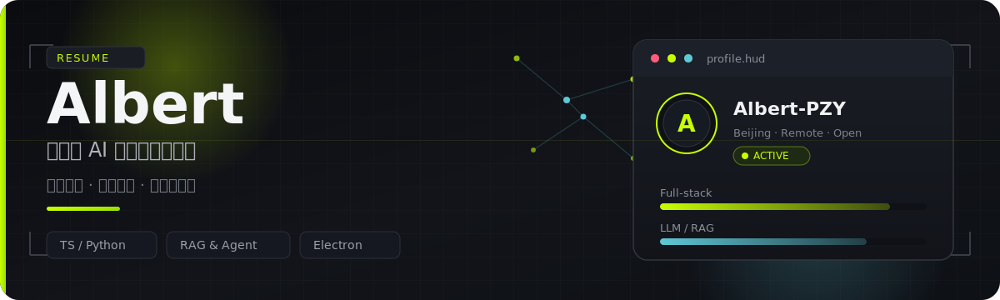

# Albert · myself

个人介绍和在线简历，顺手放在这里。

平时做全栈和 AI 应用相关的开发，页面里是我的经历、项目和一点技能说明。内容会随状态更新，当作一份活着的简历用。

  
  &nbsp;
  
  &nbsp;
  

## 在线地址

部署在 GitHub Pages：

**https://albert-pzy.github.io/myself/**

---

## 大概写了什么

|  |  |
|:--|:--|
| 方向 | 全栈、大模型应用（RAG / Agent）、桌面端 |
| 技术 | TypeScript · Python · React / Next.js · Electron |
| 状态 | 开放全栈与 AI 相关机会 |

页面本身是静态站，主题、动效和内容都在仓库里；想改文案主要看 `data.js`。

---

  

有合适的事可以来聊 · [GitHub](https://github.com/Albert-PZY)

